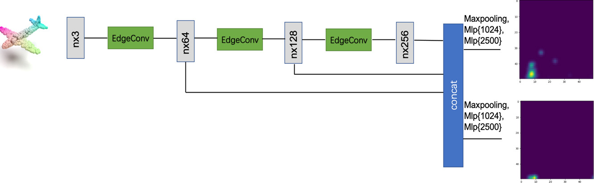
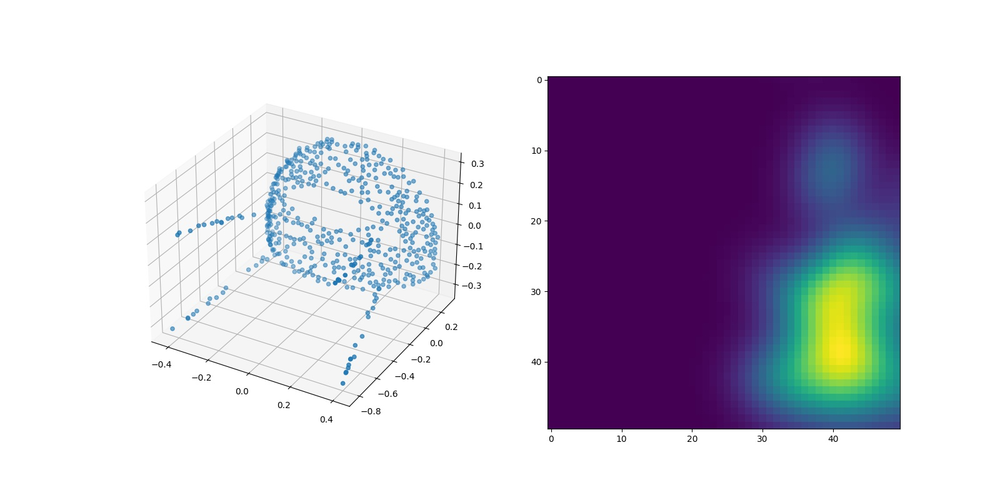
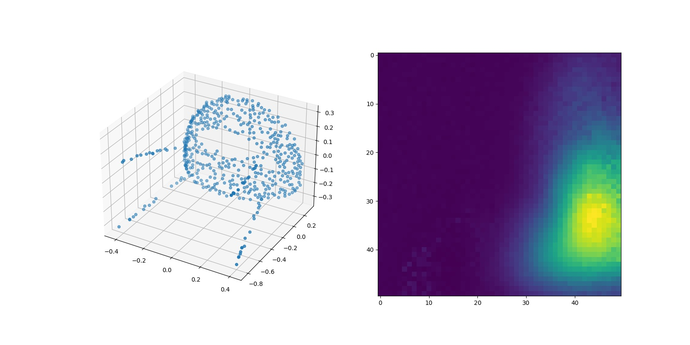

# learning persistent homology of 3d point clouds
This is an implementation of TopologyNet on Python3.

## 0. Requirements

ripser=0.6.1, persim=0.3.1, PyTorch=1.9.0 or newer, tqdm, numpy, scikit-learn

## 1. Preprocess dataset
Downsampled modelNet40 point clouds dataset is located in `./dataset/modelNet40_sample.npy`.

shape: [3407, 512, 3] represents 3407 samples with 512 3d points. 

### 1.1 Compute groundtruth PD of point clouds
`python compute_pd_modelnet.py` It may take several hours to compute PD

computed PD files are in `./PD_modelnet` dataset.

## 2. Train
`python ./utils/train_TopologyNet.py --phase train`

## 3. Test
`python ./utils/train_TopologyNet.py --phase test --model ./pis/total_pi_model_9.pth`

## 4. Visualization
plot prediticted and groundtruth PI

`python ./utils/train_TopologyNet.py --phase plot --model ./pis/total_pi_model_9.pth`

## 4. Predict toy data's PI
### 4.1 Generate Toy data
`python ./utils/toydata.py --mode generate` generated toy data is located in `./dataset/toy_data_0.2.npy`
### 4.2 Predict toy data's PI
`python ./utils/toydata.py --mode evaluate` generated predicted PI is located in `./utils/toy_pi_0.2.npy`
### 4.3 classify toy data using predicted PI
`python ./utils/toy_classify.py`

## Acknowledgments
The code in the directory is mostly taken from [pointnet.pytorch](https://github.com/fxia22/pointnet.pytorch)
